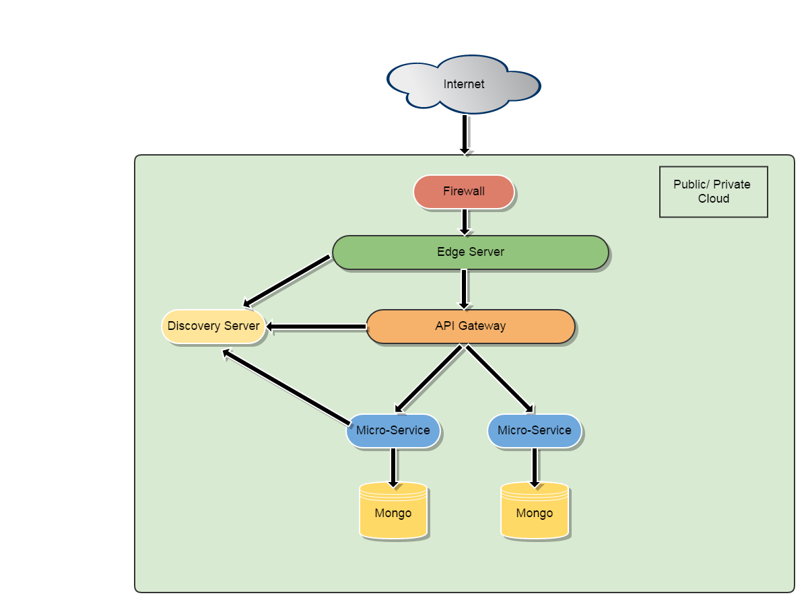

# Microservice Example based on Spring Cloud
This is an example project to demonstrate building micro-services using Spring Boot and Spring Cloud. 
The project demonstrates the following concepts :-

* Microservice development using Spring Boot
* Microservice discovery using Netflix Eureka (Spring Cloud)
* API Gateway for orchestration between microservices
* Routing using Netflix Zuul (Spring Cloud)
* SSL communication between all the services
* API documentation using Swagger
* Correlation between microservices using Spring Cloud Sleuth
* Containerisation of microservices using Docker (WIP)

## How to run
Please visit the individual projects for instructions to run the components.
* [Discovery Server](https://github.com/sambamitra/discovery-server)
* [Edge Server](https://github.com/sambamitra/edge-server)
* [Api Gateway](https://github.com/sambamitra/api-gateway)
* [Book micro-service](https://github.com/sambamitra/book)
* [Employee micro-service](https://github.com/sambamitra/employee)
* Run the services in the following order :
 1. discovery
 2. edge
 3. All other individual micro-services (book, employee etc.)
 4. api-gateway

## Architecture diagram

## Security between services
HTTPS has been configured for the full service stack. The supported SSL version is TLS 1.2.
* Edge Server -> API Gateway - One way SSL
* API Gateway -> Microservices - Two way SSL (mutual authentication)
* Services -> Discovery Server - One way SSL

## Technology choices
The following technology choices have been made.
* Edge Server - Netflix Zuul
* Discovery Server - Netflix Eureka
* API Gateway/Microservices - Spring Boot
* Datastore - MongoDB

## How to run using Docker - WIP
* Clone the project
* Build the parent project using : __mvn clean install__
* Go to the __docker__ folder under this project and run the command : __docker compose up__
* Open <http://localhost:8761/> in your browser to see the services registered to Eureka
